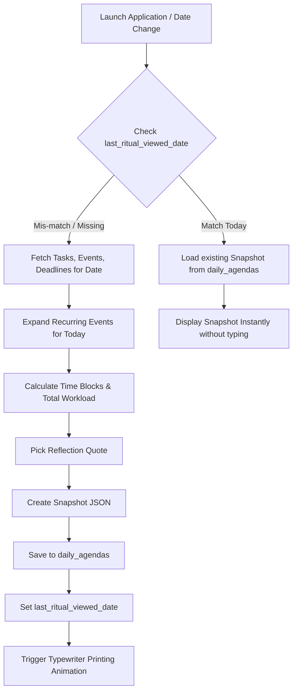

# System Architecture - The Athenaeum

This document details the modular layout, state lifecycle, data pipeline, and synchronization schemes utilized in the application.

## 1. Application Layer Structure

The application is structured into domain directories within the `src/` folder:

```
src/
├── app/                  # Next.js App Router (Layouts & Main Desk canvas)
├── components/           # Tactile UI objects (Typewriter, Books, Vase, Calendar)
├── features/             # Business units (Tasks, Goals, Calendar overlay, Focus)
├── hooks/                # Audio context, agenda compilers, viewport triggers
├── lib/                  # Zustand store configuration, Supabase configs
├── services/             # Sync engine, Supabase adapter, localStorage fallback
└── types/                # Typescript structures (agenda, goals, tasks, events)
```

---

## 2. Agenda Generation & Printing Pipeline

The daily agenda is generated via a functional compiler that transforms database records into an immutable snapshot.



---

## 3. Storage & Sync Architecture

The database layer uses an **Offline-First Fallback Adapter**. It checks if the Supabase environment keys are available and if the network is online.

```
                  +-----------------------------------+
                  |        db.ts Unified API          |
                  +-----------------------------------+
                                    |
                  +-----------------+-----------------+
                  |                                   |
        [Has Env Keys & Online]             [No Env Keys / Offline]
                  |                                   |
                  v                                   v
      +-----------------------+           +-----------------------+
      |    Supabase Engine    |           |  LocalStorage Engine  |
      |   (PostgreSQL Cloud)  |           |     (Browser Cache)   |
      +-----------------------+           +-----------------------+
```

* **Data Integrity:** Because the typewriter consumes snapshots rather than raw lists, data integrity is preserved. Modifying a task's title or status via the Calendar card will:
  1. Update the live `tasks` record.
  2. If the task is completed, it applies a visual ink stroke to the typewriter sheet.
  3. The text of the typed snapshot inside the typewriter sheet is **not rewritten**, maintaining historical consistency.

---

## 4. State Management (Zustand)

A single global Zustand store manages the scholar's desk states. This prevents prop-drilling across the absolute-positioned objects:

1. **Active Overlay View:** `desk`, `book-monthly`, `book-weekly`, `archive`, `settings`, `focus`, `create-popup`.
2. **Current Typewriter Target:** Stores the active agenda JSON document (Today's snapshot or an archive snapshot).
3. **Sound Controls:** Mute states, volume coefficients for typewriter, pen scratch, and background tracks.
4. **Timers:** State for Pomodoro intervals and active stopwatches in Focus Mode.
5. **Ritual Flags:** Controls whether the fade-in and typewriter print loop should trigger.
